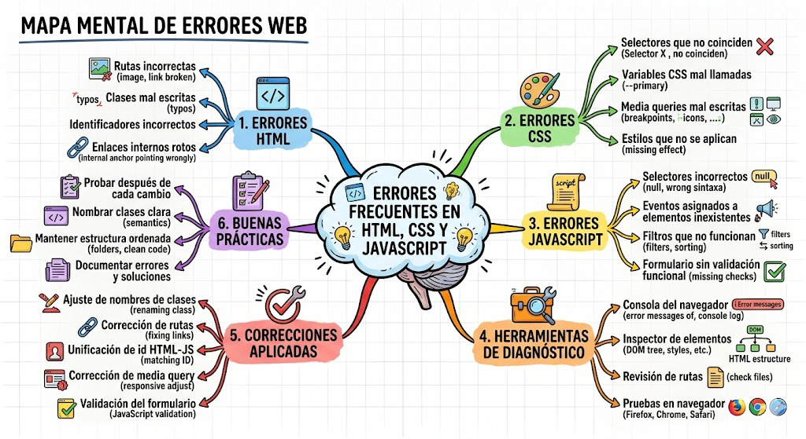

# Guía para mapa mental, mapa conceptual o notas técnicas

## Objetivo

Organizar visualmente los errores encontrados durante la actividad y explicar cómo se diagnosticaron y corrigieron.

Puedes entregar una de estas opciones:

- Mapa mental.
- Mapa conceptual.
- Notas técnicas organizadas.
- Diagrama en Canva, PowerPoint, Word, cuaderno o herramienta digital.

## Estructura sugerida

Centro del mapa:

**Errores frecuentes en HTML, CSS y JavaScript**

Ramas principales:

1. **Errores HTML**
   - Rutas incorrectas.
   - Clases mal escritas.
   - Identificadores incorrectos.
   - Enlaces internos que no apuntan a la sección correcta.

2. **Errores CSS**
   - Selectores que no coinciden.
   - Variables CSS mal llamadas.
   - Media queries mal escritas.
   - Estilos que no se aplican.

3. **Errores JavaScript**
   - Selectores incorrectos.
   - Eventos asignados a elementos inexistentes.
   - Filtros que no funcionan.
   - Formulario sin validación funcional.

4. **Herramientas de diagnóstico**
   - Consola del navegador.
   - Inspector de elementos.
   - Revisión de rutas.
   - Pruebas en navegador.

5. **Correcciones aplicadas**
   - Ajuste de nombres de clases.
   - Corrección de rutas.
   - Unificación de `id` entre HTML y JavaScript.
   - Corrección de media query.
   - Validación del formulario.

6. **Buenas prácticas**
   - Probar después de cada cambio.
   - Nombrar clases de forma clara.
   - Mantener estructura de carpetas ordenada.
   - Documentar errores y soluciones.

## Preguntas que debe responder tu mapa o notas

- ¿Qué tipos de errores encontraste?
- ¿Cómo los detectaste?
- ¿Qué herramienta te ayudó más?
- ¿Qué archivo corregiste?
- ¿Qué aprendiste para evitar esos errores en próximos proyectos?

## Criterios de evaluación

- Claridad visual.
- Organización de ideas.
- Relación correcta entre error, diagnóstico y solución.
- Uso de vocabulario técnico básico.
- Presentación limpia y comprensible.

